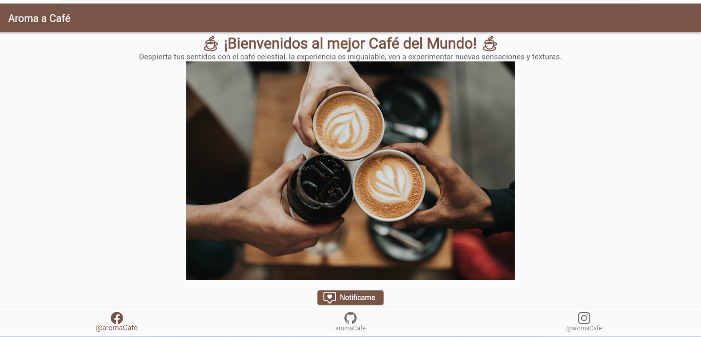
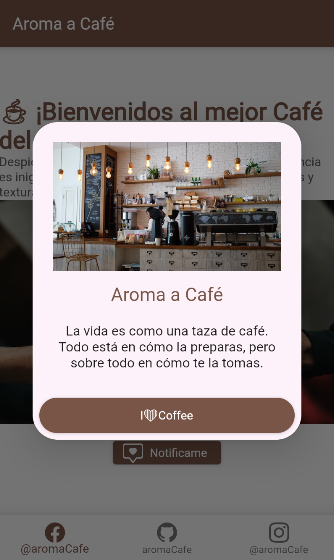

# Aroma a Cafe

Esta es una pequeña iniciativa en donde voy a ir creando un sitio web de una cafetería, en la cual voy a ir plasmando cada uno de los conceptos que vaya aprendiendo en flutter.

## Pequeña imagen del sitio web :heart_eyes:

Sigamos avanzando en flutter :sunglasses:

